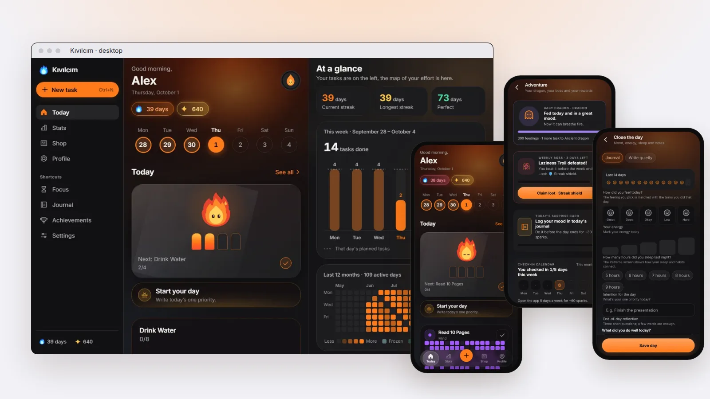
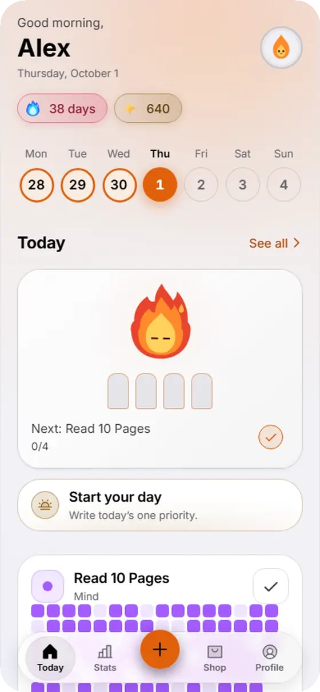
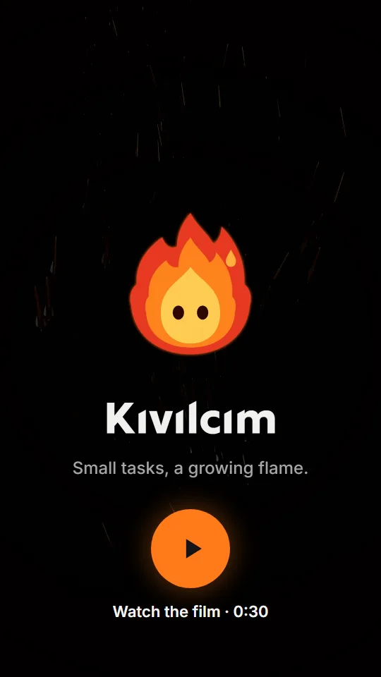

<a href="https://github.com/yigit2015/kivilcim-indir#readme"><picture><source media="(prefers-color-scheme: dark)" srcset=".github/readme/btn-lang-tr-off-dark.png"></picture></a>
<picture><source media="(prefers-color-scheme: dark)" srcset=".github/readme/btn-lang-en-on-dark.png"></picture>

<picture>
  <source media="(prefers-color-scheme: dark)" srcset=".github/readme/hero-dark-en.svg">
  
</picture>

 

<a href="https://yigit2015.github.io/kivilcim-indir/en/#indir"><picture><source media="(prefers-color-scheme: dark)" srcset=".github/readme/btn-download-dark.png"></picture></a>&nbsp;
<a href="https://yigit2015.github.io/kivilcim-indir/uygulama/"><picture><source media="(prefers-color-scheme: dark)" srcset=".github/readme/btn-web-en-dark.png"></picture></a>

<a href="https://github.com/yigit2015/kivilcim-indir/releases/latest/download/Kivilcim-windows-kurulum.exe"><picture><source media="(prefers-color-scheme: dark)" srcset=".github/readme/btn-windows-dark.png"></picture></a>&nbsp;
<a href="https://github.com/yigit2015/kivilcim-indir/releases/latest/download/Kivilcim-mac.dmg"><picture><source media="(prefers-color-scheme: dark)" srcset=".github/readme/btn-mac-dark.png"></picture></a>&nbsp;
<a href="https://github.com/yigit2015/kivilcim-indir/releases/latest/download/Kivilcim-linux.AppImage"><picture><source media="(prefers-color-scheme: dark)" srcset=".github/readme/btn-linux-dark.png"></picture></a>&nbsp;
<a href="https://github.com/yigit2015/kivilcim-indir/releases/latest/download/Kivilcim-android.apk"><picture><source media="(prefers-color-scheme: dark)" srcset=".github/readme/btn-android-dark.png"></picture></a>

No account · No ads · No purchases · iPhone version coming soon

  

<picture>
  <source media="(prefers-color-scheme: dark)" srcset=".github/readme/showcase-dark-en.webp">
  
</picture>

Screenshots from the app, sample data.

## One tap, one log

<table>
  <tr>
    <td width="300" valign="top">
      <picture>
        <source media="(prefers-color-scheme: dark)" srcset=".github/readme/dongu-dark-en.webp">
        
      </picture>
    </td>
    <td valign="top">

1. **Check off the next task.** The line under the Hearth always shows your next task; one tap is enough.
2. **A log catches fire.** Every task is a log. As you finish them, the fire under Kıvı grows.
3. **Your streak grows.** The day's first check-in adds a day to your streak and marks today on the week strip.

Recorded in the app, sample data.

</td>
  </tr>
</table>

## The film

30 seconds, with sound. Footage from the app; the user and data are samples.

## What's inside

<table>
  <tr>
    <td width="50%" valign="top">
       
      <b>The Hearth</b> 
      Every task is a log; check them off and the logs catch fire. Your next task is always within reach.
    </td>
    <td width="50%" valign="top">
       
      <b>Streak</b> 
      As your streak grows, your flame changes color: a new tier on days 7, 30, 100 and 365. Freezes and shields protect your streak.
    </td>
  </tr>
  <tr>
    <td valign="top">
       
      <b>Game</b> 
      Every task brings 10 sparks. A 7-day chest strip, a multiplier game and cosmetics bought with sparks. Sparks can't be bought with money.
    </td>
    <td valign="top">
       
      <b>Know yourself</b> 
      A 12-month heatmap, a weekly chart, patterns and an automaticity meter that shows how settled a habit is.
    </td>
  </tr>
  <tr>
    <td valign="top">
       
      <b>Rituals</b> 
      9 guided programs, a journal, breathing and Pomodoro. Close the day with small rituals.
    </td>
    <td valign="top">
       
      <b>Privacy</b> 
      No account, server, ads or purchases. Your records stay on your device; Kıvılcım works offline.
    </td>
  </tr>
</table>

Every feature and which device it works on: **[Features](https://yigit2015.github.io/kivilcim-indir/en/features/)**

## Download

Links always download the latest version. Updating doesn't delete your data.

| Device | File | Note |
|---|---|---|
| Windows | [Kivilcim-windows-kurulum.exe](https://github.com/yigit2015/kivilcim-indir/releases/latest/download/Kivilcim-windows-kurulum.exe) | Windows 10 and 11, 64-bit |
| Mac | [Kivilcim-mac.dmg](https://github.com/yigit2015/kivilcim-indir/releases/latest/download/Kivilcim-mac.dmg) | Apple Silicon and Intel |
| Linux | [AppImage](https://github.com/yigit2015/kivilcim-indir/releases/latest/download/Kivilcim-linux.AppImage) · [.deb](https://github.com/yigit2015/kivilcim-indir/releases/latest/download/Kivilcim-linux.deb) | |
| Android | [Kivilcim-android.apk](https://github.com/yigit2015/kivilcim-indir/releases/latest/download/Kivilcim-android.apk) | Android 7 and later |
| iPhone | Coming soon | Until then, the [web version](https://yigit2015.github.io/kivilcim-indir/uygulama/) works in Safari |

The app follows your device's language on first launch (English or Turkish); you can change it under Profile → "Appearance and accessibility" → "Dil · Language".

<b>Install notes</b>

- **Windows:** If a SmartScreen warning appears, choose "More info" and then "Run anyway".
- **Mac:** The app is unsigned: on first launch, right-click and choose Open. On macOS 15 and later, System Settings → Privacy & Security → "Open Anyway".
- **Linux:** Make the AppImage executable first: `chmod +x Kivilcim-linux.AppImage`. Or install the .deb package.
- **Android:** Allow installs from unknown sources when installing.

## Privacy

- **No account.** Open the app and you're in; no email or password.
- **No server.** Your tasks, streak and notes stay on your device.
- **No ads or tracking.** Details: [privacy policy](https://yigit2015.github.io/kivilcim-indir/gizlilik/#english) · Questions: [support](https://yigit2015.github.io/kivilcim-indir/en/support/)

## Release notes

What changed in each version: [release notes](https://yigit2015.github.io/kivilcim-indir/en/releases/) · Earlier files: [Releases](https://github.com/yigit2015/kivilcim-indir/releases)

 

This repository has no app code; only the installers and the website. The site uses no cookies, analytics or outside requests.
