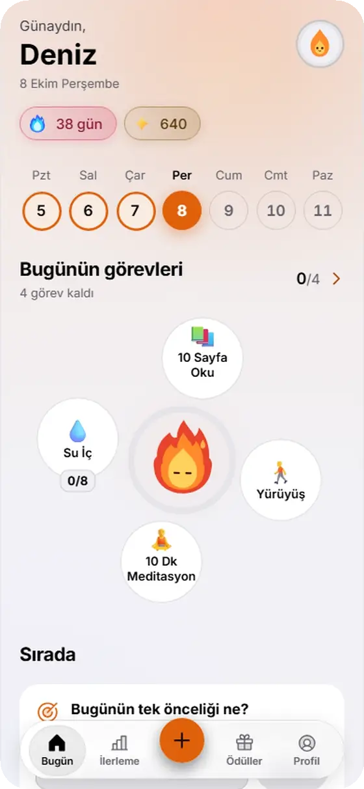

<picture><source media="(prefers-color-scheme: dark)" srcset=".github/readme/btn-lang-tr-on-dark.png"></picture>
<a href="README.en.md"><picture><source media="(prefers-color-scheme: dark)" srcset=".github/readme/btn-lang-en-off-dark.png"></picture></a>

<picture>
  <source media="(prefers-color-scheme: dark)" srcset=".github/readme/hero-dark.svg">
  
</picture>

 

<a href="https://yigit2015.github.io/kivilcim-indir/#indir"><picture><source media="(prefers-color-scheme: dark)" srcset=".github/readme/btn-indir-dark.png"></picture></a>&nbsp;
<a href="https://yigit2015.github.io/kivilcim-indir/uygulama/"><picture><source media="(prefers-color-scheme: dark)" srcset=".github/readme/btn-web-dark.png"></picture></a>

<a href="https://github.com/yigit2015/kivilcim-indir/releases/latest/download/Kivilcim-windows-kurulum.exe"><picture><source media="(prefers-color-scheme: dark)" srcset=".github/readme/btn-windows-dark.png"></picture></a>&nbsp;
<a href="https://github.com/yigit2015/kivilcim-indir/releases/latest/download/Kivilcim-mac.dmg"><picture><source media="(prefers-color-scheme: dark)" srcset=".github/readme/btn-mac-dark.png"></picture></a>&nbsp;
<a href="https://github.com/yigit2015/kivilcim-indir/releases/latest/download/Kivilcim-linux.AppImage"><picture><source media="(prefers-color-scheme: dark)" srcset=".github/readme/btn-linux-dark.png"></picture></a>&nbsp;
<a href="https://github.com/yigit2015/kivilcim-indir/releases/latest/download/Kivilcim-android.apk"><picture><source media="(prefers-color-scheme: dark)" srcset=".github/readme/btn-android-dark.png"></picture></a>

Hesap yok · Reklam yok · Satın alma yok · iPhone sürümü yakında

  

<picture>
  <source media="(prefers-color-scheme: dark)" srcset=".github/readme/showcase-dark.webp">
  
</picture>

Uygulamadan ekran görüntüleri, örnek veri.

## Bir dokunuş, bir adım

<table>
  <tr>
    <td width="300" valign="top">
      <picture>
        <source media="(prefers-color-scheme: dark)" srcset=".github/readme/dongu-dark.webp">
        
      </picture>
    </td>
    <td valign="top">

1. **Baloncuğa dokun.** Kıvı ortada durur, bugünün görevleri çevresinde baloncuk olarak süzülür. Dokun, tamamla; basılı tut, seçenekler açılsın.
2. **Halka dolar.** Her görev Kıvı'nın çevresindeki halkayı biraz daha doldurur. Hepsi bitince halka tam kapanır.
3. **Seri büyür.** Günün ilk tikiyle seri bir gün uzar, hafta şeridinde bugün işaretlenir.

Uygulamadan kayıt, örnek veri.

</td>
  </tr>
</table>

## Tanıtım filmi

30 saniye, sesli. Görüntüler uygulamadan, kullanıcı ve veriler örnektir.

https://github.com/user-attachments/assets/8faaa3ea-f29c-4d0d-84ee-c61087552e53

## Neler var

<table>
  <tr>
    <td width="50%" valign="top">
       
      <b>Yörünge</b> 
      Görevler Kıvı'nın çevresinde baloncuk; halka günün ilerlemesini gösterir. Altındaki "Sırada" kartı tek bir sonraki adımı önerir.
    </td>
    <td width="50%" valign="top">
       
      <b>Seri</b> 
      Seri büyüdükçe alevin rengi değişir: 7, 30, 100 ve 365. günlerde yeni bir kademe. Dondurucu ve kalkan serini korur.
    </td>
  </tr>
  <tr>
    <td valign="top">
       
      <b>Oyun</b> 
      Her görev 10 kıvılcım getirir. 7 günlük sandık şeridi, çarpan oyunu ve kıvılcımla alınan kozmetikler. Kıvılcım parayla alınmaz.
    </td>
    <td valign="top">
       
      <b>Kendini tanı</b> 
      12 aylık ısı haritası, haftalık grafik, örüntüler ve bir alışkanlığın ne kadar oturduğunu gösteren otomatiklik ölçer.
    </td>
  </tr>
  <tr>
    <td valign="top">
       
      <b>Ritüeller</b> 
      9 hazır program, günlük defter, nefes ve Pomodoro. Günü küçük ritüellerle kapat.
    </td>
    <td valign="top">
       
      <b>Gizlilik</b> 
      Hesap, sunucu, reklam ve satın alma yok. Kayıtların cihazında kalır; Kıvılcım internetsiz çalışır.
    </td>
  </tr>
</table>

Bütün özellikler ve hangisinin hangi cihazda çalıştığı: **[Özellikler](https://yigit2015.github.io/kivilcim-indir/ozellikler/)**

## İndir

Bağlantılar hep son sürümü indirir. Güncelleme verini silmez.

| Cihaz | Dosya | Not |
|---|---|---|
| Windows | [Kivilcim-windows-kurulum.exe](https://github.com/yigit2015/kivilcim-indir/releases/latest/download/Kivilcim-windows-kurulum.exe) | Windows 10 ve 11, 64 bit |
| Mac | [Kivilcim-mac.dmg](https://github.com/yigit2015/kivilcim-indir/releases/latest/download/Kivilcim-mac.dmg) | Apple Silicon ve Intel |
| Linux | [AppImage](https://github.com/yigit2015/kivilcim-indir/releases/latest/download/Kivilcim-linux.AppImage) · [.deb](https://github.com/yigit2015/kivilcim-indir/releases/latest/download/Kivilcim-linux.deb) | |
| Android | [Kivilcim-android.apk](https://github.com/yigit2015/kivilcim-indir/releases/latest/download/Kivilcim-android.apk) | Android 7 ve üstü |
| iPhone | Yakında | O zamana kadar [web sürümü](https://yigit2015.github.io/kivilcim-indir/uygulama/) Safari'de çalışır |

<b>Kurulum notları</b>

- **Windows:** SmartScreen uyarısı çıkarsa "Ek bilgi" ve ardından "Yine de çalıştır".
- **Mac:** Uygulama imzasız: ilk açılışta sağ tıkla ve Aç'ı seç. macOS 15 ve sonrasında Sistem Ayarları → Gizlilik ve Güvenlik → "Yine de Aç".
- **Linux:** AppImage dosyasına önce çalıştırma izni ver: `chmod +x Kivilcim-linux.AppImage`. İstersen .deb paketini kur.
- **Android:** Kurarken bilinmeyen kaynaklardan kuruluma izin ver.

## Gizlilik

- **Hesap yok.** Uygulamayı açınca başlarsın; e-posta ya da şifre istenmez.
- **Sunucu yok.** Görevlerin, serin ve notların cihazında kalır.
- **Reklam ve izleme yok.** Ayrıntılar: [gizlilik politikası](https://yigit2015.github.io/kivilcim-indir/gizlilik/) · Sorular: [destek](https://yigit2015.github.io/kivilcim-indir/destek/)

## Sürüm notları

Her sürümde neyin değiştiği: [sürüm notları](https://yigit2015.github.io/kivilcim-indir/surumler/) · Önceki dosyalar: [Releases](https://github.com/yigit2015/kivilcim-indir/releases)

 

Bu depoda uygulamanın kodu yok; yalnız kurulum dosyaları ve tanıtım sitesi var. Site çerez, analiz ya da dış istek kullanmaz.
